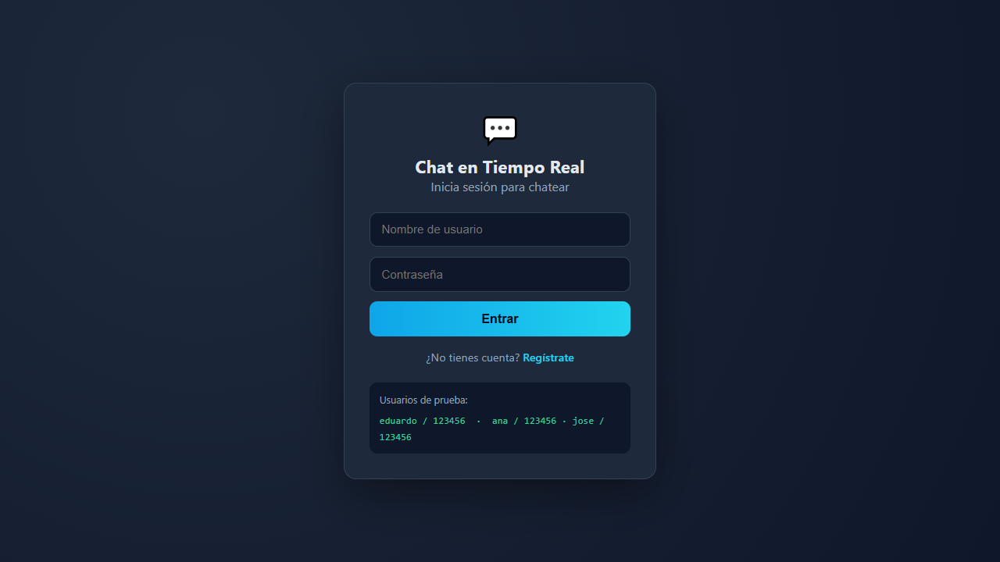
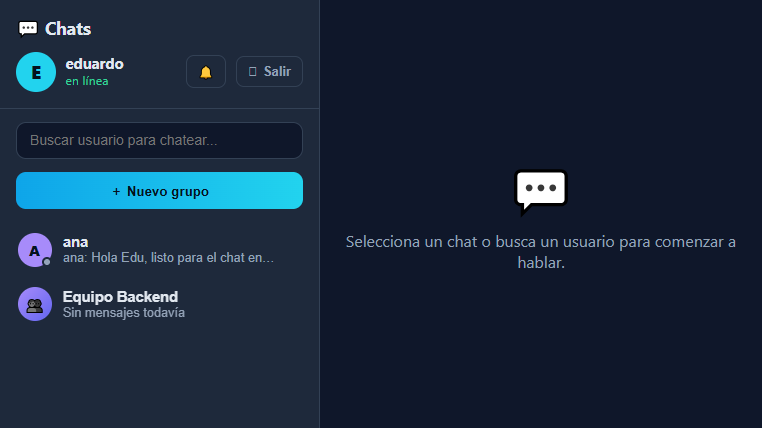

# 💬 Chat en Tiempo Real

Aplicación de mensajería instantánea tipo WhatsApp/Discord construida con una
arquitectura **monorepo**: API REST + Socket.io en Node.js y una interfaz web en
React. Los mensajes llegan en menos de un segundo, sin recargar la página.

## 🚀 Demo en vivo

| Servicio | URL |
|---|---|
| Frontend (React) | https://real-time-chat-frontend-tav1.onrender.com |
| Backend (API + Socket.io) | https://real-time-chat-api-rqfs.onrender.com |

**Usuarios de prueba** (todos con contraseña `123456`):

- `eduardo`
- `ana`
- `jose`

## ✨ Características

**Núcleo**
- Registro e inicio de sesión con JWT (`2d` de validez).
- Chats directos (1 a 1) creados automáticamente al buscar un usuario.
- Grupos con varios miembros, presencia en línea / desconectado.
- Indicador "escribiendo..." en tiempo real.
- Historial persistente en PostgreSQL (Neon).

**Mejoras (17 funcionalidades)**
1. 📄 Adjuntar archivos e imágenes (PDF, docs, hojas de cálculo, ZIP, etc., máx. 10 MB).
2. 🙌 Reacciones con emojis sobre cualquier mensaje (doble clic o botón 😀).
3. ↩️ Responder o citar un mensaje con vista previa.
4. 🔔 Notificaciones del sistema + sonido de llegada (activables en el encabezado).
5. ✅ Check verde de mensaje nuevo con animación al llegar.
6. 👥 Ver miembros, renombrar y eliminar grupos (solo el creador).
7. 📌 Ocultar conversaciones localmente (se recuperan al recibir un mensaje nuevo).
8. 🎨 Avatar de color único por usuario.
9. 🔍 Buscar usuarios y mensajes dentro de una conversación.
10. 📄 Paginación de historial ("Cargar mensajes anteriores").
11. ✏️ Editar y 🗑 eliminar mensajes propios.
12. ✓✓ Confirmación de lectura por mensaje.
13. 👋 Salir de un grupo.
14. ✔ Validación de entrada con `express-validator`.
15. 🛡 Rate limiting para proteger la API.
16. 📱 Diseño responsive para móvil y escritorio.
17. 🧪 Suite de pruebas automatizadas (Jest + PostgreSQL real).

## 🏗 Arquitectura

```
Chat-Tiempo-Real/
├── backend/                     # API REST + Socket.io (Express)
│   ├── src/
│   │   ├── config/              # Conexión a PostgreSQL (Sequelize)
│   │   ├── models/              # User, Conversation, Message, ConversationParticipant
│   │   ├── controllers/         # Lógica de auth, conversaciones y mensajes
│   │   ├── middleware/          # Auth JWT, validación, manejo de errores
│   │   ├── routes/              # Definición de endpoints REST
│   │   └── sockets/             # Eventos Socket.io (tiempo real)
│   ├── tests/                   # Pruebas Jest (auth, conversaciones, mensajes)
│   └── package.json
├── frontend/                    # SPA en React 19 + Vite
│   └── src/
│       ├── api/                 # Cliente HTTP
│       ├── components/          # Sidebar, ChatWindow, Login, Register, ...
│       ├── context/             # Autenticación global
│       ├── utils/               # Sonido y notificaciones
│       ├── socket.js            # Conexión Socket.io
│       └── index.css            # Estilos
└── docs/                        # Capturas de pantalla
```

**Eventos Socket.io:** `message:new`, `message:update`, `message:delete`,
`messages:read`, `conversation:update`, `conversation:removed`, `members:update`,
`presence:update`, `typing`.

**API principal (prefijo `/api`):**

| Método | Ruta | Descripción |
|---|---|---|
| POST | `/auth/register` · `/auth/login` | Registro e inicio de sesión |
| GET | `/users/search?q=` | Buscar usuarios |
| GET | `/conversations` | Listar conversaciones |
| POST | `/conversations/direct` | Crear / recuperar chat 1 a 1 |
| POST | `/conversations/group` | Crear grupo |
| GET | `/conversations/:id/messages` | Historial paginado |
| POST | `/conversations/:id/messages` | Enviar mensaje (texto, imagen, archivo, respuesta) |
| PUT | `/conversations/:id/messages/:msgId` | Editar mensaje |
| DELETE | `/conversations/:id/messages/:msgId` | Eliminar mensaje |
| PUT | `/conversations/:id/messages/:msgId/reactions` | Alternar reacción (emoji) |
| GET | `/conversations/:id/messages/search?q=` | Buscar mensajes |
| POST | `/conversations/:id/read` | Marcar como leído |
| GET | `/conversations/:id/members` | Ver miembros del grupo |
| DELETE | `/conversations/:id/participants/me` | Salir del grupo |
| PUT | `/conversations/:id` | Renombrar grupo (solo creador) |
| DELETE | `/conversations/:id` | Eliminar grupo (solo creador) |

## 🛠 Stack tecnológico

- **Frontend:** React 19, Vite, Socket.io Client, CSS puro (variables).
- **Backend:** Node.js, Express, Socket.io, Sequelize 6, JWT, `express-validator`,
  `express-rate-limit`.
- **Base de datos:** PostgreSQL (Neon, servidor en la nube).
- **Despliegue:** Render (auto-deploy desde `main`).
- **Tests:** Jest + supertest sobre una base `chat_test`.

## ▶️ Ejecutar en local

Requisitos: Node.js 18+ y una base PostgreSQL (la de producción es Neon).

### 1. Base de datos

Crea una base en [Neon](https://neon.tech) (o PostgreSQL local) y copia su URI en
`backend/.env`.

### 2. Backend

```bash
cd backend
cp .env.example .env   # completa DATABASE_URL, JWT_SECRET, FRONTEND_URL
npm install
npm run migrate        # crea/actualiza tablas
npm start              # http://localhost:5000
```

### 3. Frontend

```bash
cd frontend
npm install
npm run dev            # http://localhost:5173
```

La API local usa la variable `VITE_API_URL` (por defecto apunta a `/api` vía el
proxy de Vite configurado en `vite.config.js`).

### Tests

```bash
cd backend
cp .env.example .env.test   # usa la URI a la base chat_test
npm test                    # 38 pruebas
```

## 📷 Capturas

| Inicio de sesión | Vista del chat | Miembros del grupo |
|---|---|---|
|  |  |  |

## 🔑 Variables de entorno

**backend/.env**

| Variable | Descripción |
|---|---|
| `DATABASE_URL` | URI de conexión PostgreSQL |
| `JWT_SECRET` | Secreto para firmar tokens |
| `JWT_EXPIRES_IN` | Expiración del token (ej. `2d`) |
| `FRONTEND_URL` | Origen permitido por CORS |

**frontend/.env**

| Variable | Descripción |
|---|---|
| `VITE_API_URL` | URL base de la API (vacío = relativa) |

## 📄 Licencia

Proyecto educativo. Autor: **Eduard Alejandro Vega Diaz**.